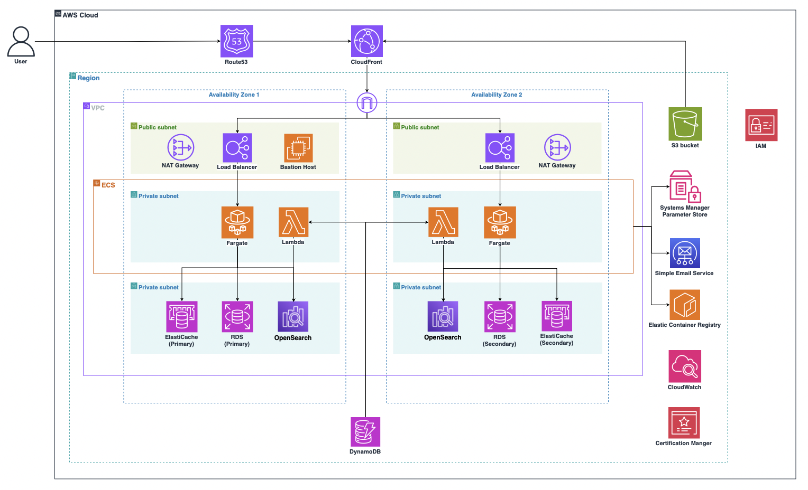

# Kyobo CDA. AWS를 활용한 글로벌 식당 예약 서비스
🏆 **프로젝트 최우수상 수상작**  

## 📄 목차
- [📄 목차](#-목차)
- [✍🏻 프로젝트 개요](#-프로젝트-개요)
- [🔍 프로젝트 배경](#-프로젝트-배경)
  - [1️⃣ 트래픽 집중에 따른 서비스 불안정](#1️⃣-트래픽-집중에-따른-서비스-불안정)
  - [2️⃣ 중복 예약 및 오버부킹 문제](#2️⃣-중복-예약-및-오버부킹-문제)
  - [3️⃣ 예약 서비스 이용률 증가](#3️⃣-예약-서비스-이용률-증가)
- [🎯 설계 목표](#-설계-목표)
  - [1️⃣ Microservice Architecture 도입](#1️⃣-microservice-architecture-도입)
  - [2️⃣ 확장성과 유연성 보장](#2️⃣-확장성과-유연성-보장)
  - [3️⃣ 성능 최적화](#3️⃣-성능-최적화)
  - [4️⃣ 글로벌 사용자 경험 최적화](#4️⃣-글로벌-사용자-경험-최적화)
  - [5️⃣ 로그 수집 및 에러 로깅](#5️⃣-로그-수집-및-에러-로깅)
- [🚀 시스템 아키텍처](#-시스템-아키텍처)
- [💡 주요 기능](#-주요-기능)
  - [1️⃣ 회원 기능](#1️⃣-회원-기능)
  - [2️⃣ 검색 기능](#2️⃣-검색-기능)
  - [3️⃣ 예약 기능](#3️⃣-예약-기능)
- [📹 시연 영상](#-시연-영상)
- [🛠 기술 스택](#-기술-스택)
- [🧑‍💻 Team.9900 팀원](#-team9900-팀원소개)
- [📆 프로젝트 진행기간](#-진행기간)
***
## ✍🏻 프로젝트 개요
이 프로젝트는 **교보 DTS-Cloud architecture DX Academy(CDA) 1기 과정**에서 최종 프로젝트로 진행한 **AWS를 활용한 글로벌 식당 예약 플랫폼 인프라 구축 프로젝트**입니다. **AWS 클라우드 서비스**를 활용해 **확장 가능하고 안정적인 인프라**를 설계하고, 글로벌 확장을 고려한 시스템 운영을 목표로 합니다.

## 🔍 프로젝트 배경
#### 1️⃣ 트래픽 집중에 따른 서비스 불안정
- 특정 시즌(연말연시, 명절, 크리스마스 등) 또는 소셜미디어 트렌드로 인해 인기 있는 식당 예약 요청이 급증하여 서버 부하 및 시스템 중단이 발생
- 예약 실패로 인해 고객 불만이 증가

#### 2️⃣ 중복 예약 및 오버부킹 문제
- 실시간 데이터 동기화 부족으로 인해 이중 예약 또는 오버부킹 발생
- 고객에게 예약이 완료되었다는 알림이 발송되었지만 실제로는 자리가 없는 상황이 초래되어 서비스 신뢰도 저하

#### 3️⃣ 예약 서비스 이용률 증가
- 최근 O2O(Online to Offline) 서비스와 예약 플랫폼의 사용률이 폭발적으로 증가
- 안정적인 데이터 관리와 트래픽 응답성이 필수

> ***O2O(Online to Offline) 서비스*** 
> 온라인과 오프라인을 연결하여 사용자들에게 보다 편리한 서비스를 제공하는 플랫폼 또는 비즈니스 모델 

## 🎯 설계 목표
#### 1️⃣ Microservice Architecture 도입
- 예약 및 검색 기능에 트래픽이 집중될 것으로 예상되므로 해당 기능을 독립적으로 확장하고 유지보수를 용이하게 하기 위해 MSA를 도입합니다.

#### 2️⃣ 확장성과 유연성 보장
- AWS ECS(Elastic Container Service) 기반 컨테이너 배포를 통해 자동 확장과 트래픽 급증에 유연한 대응이 가능하도록 설계합니다.

#### 3️⃣ 성능 최적화
- 서비스별 특성에 맞는 최적의 데이터베이스를 선택해 읽기/쓰기 성능을 극대화하도록 구성합니다.

#### 4️⃣ 글로벌 사용자 경험 최적화
- AWS CloudFront와 CloudFront Functions를 활용해 글로벌 사용자에게 지연 시간이 최소화된 콘텐츠를 제공하고, 가장 가까운 리전으로 요청을 리다이렉트하여 빠르고 안정적인 서비스 경험을 보장합니다.

#### 5️⃣ 로그 수집 및 에러 로깅
- 애플리케이션 로그를 수집해 추후 데이터 분석 기반을 마련하고, 에러 발생 시 Slack 알림 전송을 통해 신속한 문제 대응 체계를 구축합니다.

## 🚀 시스템 아키텍처
> **단일 리전 아키텍처**

> **멀티 리전 아키텍처**

 

> **컨테이너 및 데이터베이스 구성**

 

> **로그 수집 및 에러 로깅**

## 💡 주요 기능
#### 1️⃣ 회원 기능
  * JWT(Json Web Token) 방식을 사용해 로그인 제공
  * 마이페이지에서 예약 내역 조회 및 관리(예약 내용 확인 및 삭제)
#### 2️⃣ 검색 기능
  * 위치 기반 식당 검색 기능(Google Maps API를 사용하여 검색한 식당 위치 제공)  
  * 식당 상세 정보 및 메뉴 제공(메뉴, 가격, 주소, 등)
  * 식당명, 음식유형(한식, 중식, 양식 등), 주소 여러 조건을 조합하여 식당 검색 제공
#### 3️⃣ 예약 기능
- 예약 가능 시간대 조회
	- 사용자가 선택한 날짜와 시간대의 예약 가능 여부를 조회
    * 예약 가능 시간대를 달력 및 시간 슬롯 형식으로 시각적으로 제공
- 예약 생성 및 알림 전송
	- 사용자가 선택한 날짜와 시간대에 예약을 신청
    * 예약이 성공적으로 완료되었음을 사용자에게 이메일 알림 전송
- 예약 취소 및 알림 전송
    * 사용자가 마이페이지에서 기존에 신청한 예약을 취소
    * 예약이 성공적으로 취소되면 사용자에게 이메일 알림 전송
- 예약 대기 및 알림 전송
    * 예약이 다 꽉찬 시간대의 경우 예약 대기 버튼이 표시됨
    * 사용자는 해당 시간대에 예약 대기 신청
    * 해당 시간대에 자리가 생길경우 대기 신청한 사용자 모두에게 이메일 알림 전송
- 예약 정보 조회
    * 사용자가 예약한 정보를 조회하여 확인
    * 예약된 날짜, 시간, 식당 이름, 인원수, 예약 상태 표시

## 📹 시연 영상

## 🛠 기술 스택

| 
분류
 | 
기술 스택
                                                                                                                                                                                                                                                                                                                                                                                                                       |
| ------------------- | -------------------------------------------------------------------------------------------------------------------------------------------------------------------------------------------------------------------------------------------------------------------------------------------------------------------------------------------------------------------------------------------------------------------------------------------- |
| 프론트엔드               |                                                |
| 백엔드                 |     |
| 배포                  |                                                                                                                                                                                                                                                                                                                         |
| 로그수집 및 에러로깅         |                                                                                  |
| 협업                  |                                                      |

## 🧑‍💻 Team.9900 팀원소개

| 고진혁 | 이태현 | 박성은 | 김지현 |
| --- | --- | --- | --- |
| 

 | 

 | 

 | 

 |
| 
[KJH0476](https://github.com/KJH0476)
 | 
[taehyunmandoo](https://github.com/taehyunmandoo)
 | 
[bada0310](https://github.com/bada0310)
 | 
[jjihn](https://github.com/jjihn)
 |
| 
백엔드 개발 및 배포 데이터베이스 설계 모니터링 구축 인프라 설계 및 구축 발표
 | 
프론트엔드 개발 및 배포 인프라 설계 UI/UX설계
 | 
모니터링 설계 문서작업 인프라 구축 발표
 | 
UI/UX 설계 문서작업 인프라 설계
 |

## 📅 진행기간
- `2024.10.28` ~ `2024.12.02`(5주)

